# SpringSecurity

## **1.** **SpringSecurity** **框架简介**

### **1.1** **概要**

Spring 是非常流行和成功的 Java 应用开发框架，Spring Security 正是 Spring 家族中的成员。Spring Security 基于 Spring 框架，提供了一套 Web 应用安全性的完整解决方案。

正如你可能知道的关于安全方面的两个主要区域是“**认证**”和“**授权**”（或者访问控制），一般来说，Web 应用的安全性包括**用户认证（Authentication）和用户授权****（Authorization）**两个部分，这两点也是 Spring Security 重要核心功能。

（1）用户认证指的是：验证某个用户是否为系统中的合法主体，也就是说用户能否访问该系统。用户认证一般要求用户提供用户名和密码。系统通过校验用户名和密码来完成认证过程。**通俗点说就是系统认为用户是否能登录**

（2）用户授权指的是验证某个用户是否有权限执行某个操作。在一个系统中，不同用户所具有的权限是不同的。比如对一个文件来说，有的用户只能进行读取，而有的用户可以进行修改。一般来说，系统会为不同的用户分配不同的角色，而每个角色则对应一系列的权限。**通俗点讲就是系统判断用户是否有权限去做某些事情。**

### **1.2** **历史**

“Spring Security 开始于 2003 年年底,““spring 的 acegi 安全系统”。 起因是 Spring开发者邮件列表中的一个问题,有人提问是否考虑提供一个基于 spring 的安全实现。

Spring Security 以“The Acegi Secutity System for Spring” 的名字始于 2013 年晚些时候。一个问题提交到 Spring 开发者的邮件列表，询问是否已经有考虑一个机遇 Spring 的安全性社区实现。那时候 Spring 的社区相对较小（相对现在）。实际上 Spring 自己在2013 年只是一个存在于 ScourseForge 的项目，这个问题的回答是一个值得研究的领域，虽然目前时间的缺乏组织了我们对它的探索。

考虑到这一点，一个简单的安全实现建成但是并没有发布。几周后，Spring 社区的其他成员询问了安全性，这次这个代码被发送给他们。其他几个请求也跟随而来。到 2014 年一月大约有 20 万人使用了这个代码。这些创业者的人提出一个 SourceForge 项目加入是为了，这是在 2004 三月正式成立。

在早些时候，这个项目没有任何自己的验证模块，身份验证过程依赖于容器管理的安全性和 Acegi 安全性。而不是专注于授权。开始的时候这很适合，但是越来越多的用户请求额外的容器支持。容器特定的认证领域接口的基本限制变得清晰。还有一个相关的问题增加新的容器的路径，这是最终用户的困惑和错误配置的常见问题。

Acegi 安全特定的认证服务介绍。大约一年后，Acegi 安全正式成为了 Spring 框架的子项目。1.0.0 最终版本是出版于 2006 -在超过两年半的大量生产的软件项目和数以百计的改进和积极利用社区的贡献。

Acegi 安全 2007 年底正式成为了 Spring 组合项目，更名为"Spring Security"。

### **1.3** **同款产品对比**

#### **1.3.1 Spring Security**

Spring 技术栈的组成部分。

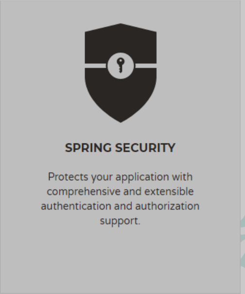

通过提供完整可扩展的认证和授权支持保护你的应用程序。

https://spring.io/projects/spring-security

SpringSecurity 特点：

⚫ 和 Spring 无缝整合。

⚫ 全面的权限控制。

⚫ 专门为 Web 开发而设计。

​	◼旧版本不能脱离 Web 环境使用。

​	◼新版本对整个框架进行了分层抽取，分成了核心模块和 Web 模块。单独引入核心模块就可以脱离 Web 环境。

⚫ 重量级。

#### **1.3.2 Shiro**

Apache 旗下的轻量级权限控制框架。


特点：

⚫ 轻量级。Shiro 主张的理念是把复杂的事情变简单。针对对性能有更高要求的互联网应用有更好表现。

⚫ 通用性。

​	◼好处：不局限于 Web 环境，可以脱离 Web 环境使用。

​	◼缺陷：在 Web 环境下一些特定的需求需要手动编写代码定制。

Spring Security 是 Spring 家族中的一个安全管理框架，实际上，在 Spring Boot 出现之前，Spring Security 就已经发展了多年了，但是使用的并不多，安全管理这个领域，一直是 Shiro 的天下。

相对于 Shiro，在 SSM 中整合 Spring Security 都是比较麻烦的操作，所以，Spring Security 虽然功能比 Shiro 强大，但是使用反而没有 Shiro 多（Shiro 虽然功能没有Spring Security 多，但是对于大部分项目而言，Shiro 也够用了）。

自从有了 Spring Boot 之后，Spring Boot 对于 Spring Security 提供了自动化配置方案，可以使用更少的配置来使用 Spring Security。

因此，一般来说，常见的安全管理技术栈的组合是这样的：

• SSM + Shiro

• Spring Boot/Spring Cloud + Spring Security

**以上只是一个推荐的组合而已，如果单纯从技术上来说，无论怎么组合，都是可以运行****的。**

### **1.4** **模块划分**

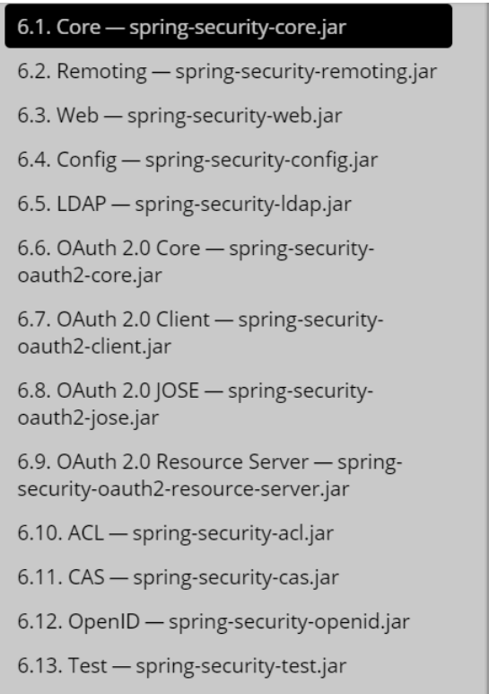

## **2. SpringSecurity** **入门案例**

### **2.1** **创建一个项目**

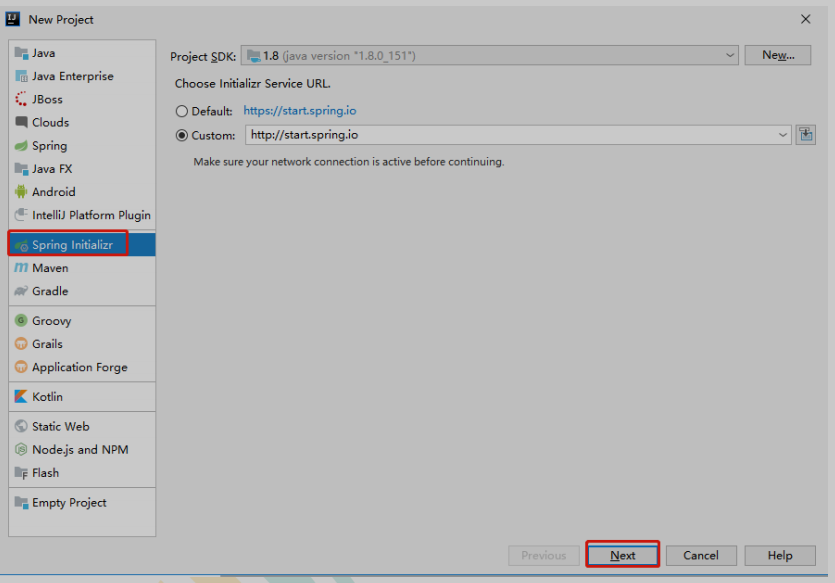

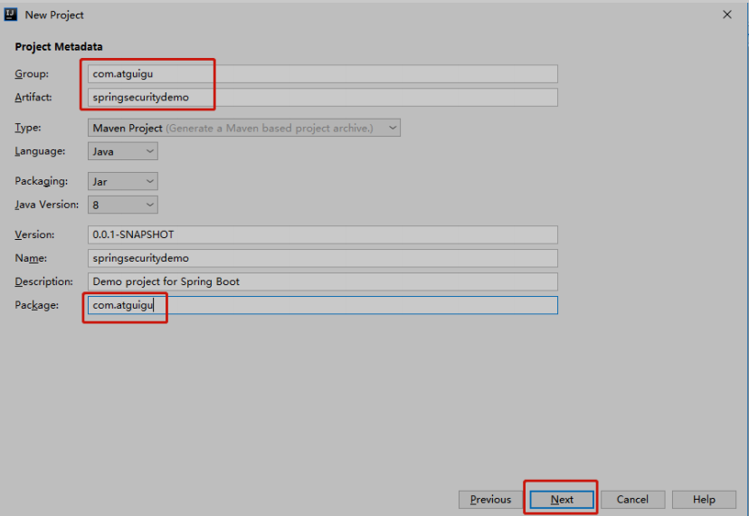

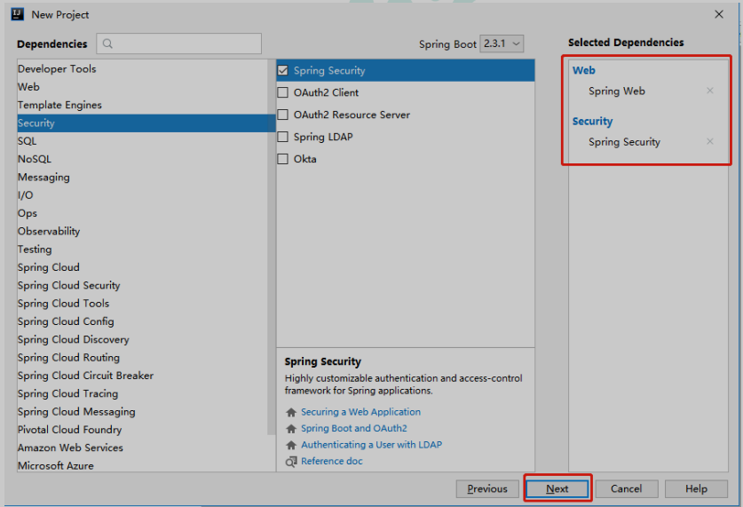

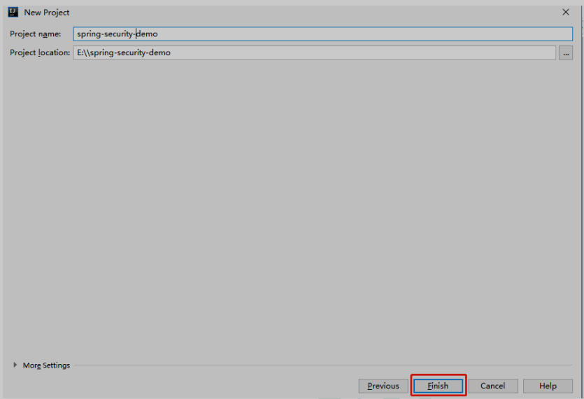

添加一个配置类：

```java
@Configuration
public class SecurityConfigextends WebSecurityConfigurerAdapter {
@Override
protected void configure(HttpSecurity http) throws Exception {
 http.formLogin() // 表单登录
.and()
 .authorizeRequests() // 认证配置
.anyRequest() // 任何请求
.authenticated(); // 都需要身份验证
}}
```

### **2.2** **运行这个项目**

访问 localhost:8080

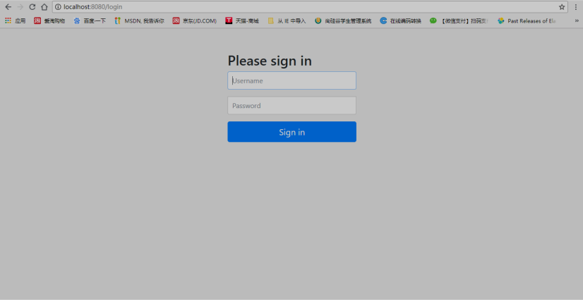

默认的用户名：user

密码在项目启动的时候在控制台会打印，**注意每次启动的时候密码都回发生变化！**

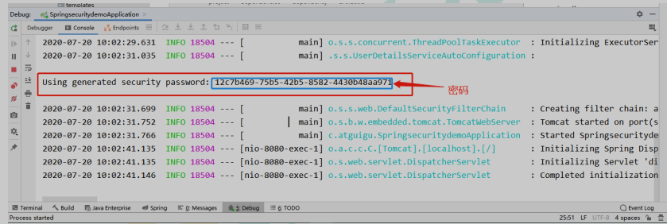

输入用户名，密码，这样表示可以访问了，404 表示我们没有这个控制器，但是我们可以访问了。

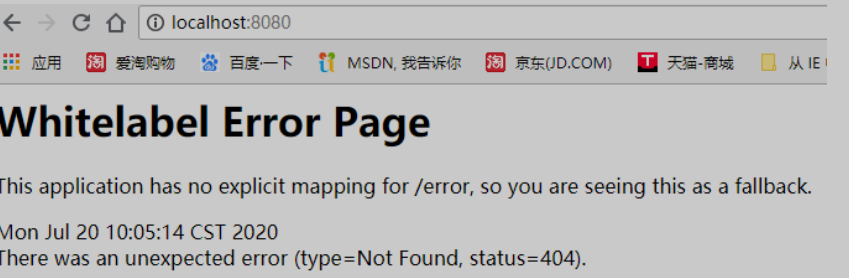

### **2.3** **权限管理中的相关概念**

#### **2.3.1** **主体**

英文单词：principal

使用系统的用户或设备或从其他系统远程登录的用户等等。简单说就是谁使用系统谁就是主体。

#### **2.3.2** **认证**

英文单词：authentication

权限管理系统确认一个主体的身份，允许主体进入系统。简单说就是“主体”证明自己是谁。

笼统的认为就是以前所做的登录操作。

#### **2.3.3** **授权**

英文单词：authorization

将操作系统的“权力”“授予”“主体”，这样主体就具备了操作系统中特定功能的能力。

所以简单来说，授权就是给用户分配权限。

### **2.4** **添加一个控制器进行访问**

```java
package com.atguigu.controller;
@Controller
public class IndexController {
@GetMapping("index")
@ResponseBody
public String index(){
return "success";
 } }
```

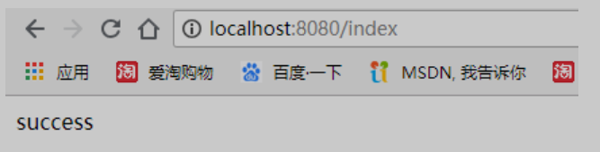

### **2.5 SpringSecurity** **基本原理**

SpringSecurity 本质是一个过滤器链：

从启动是可以获取到过滤器链：

```java
org.springframework.security.web.context.request.async.WebAsyncManagerIntegrationFilter
org.springframework.security.web.context.SecurityContextPersistenceFilter 
org.springframework.security.web.header.HeaderWriterFilter
org.springframework.security.web.csrf.CsrfFilter
org.springframework.security.web.authentication.logout.LogoutFilter 
org.springframework.security.web.authentication.UsernamePasswordAuthenticationFilter 
org.springframework.security.web.authentication.ui.DefaultLoginPageGeneratingFilter 
org.springframework.security.web.authentication.ui.DefaultLogoutPageGeneratingFilter
org.springframework.security.web.savedrequest.RequestCacheAwareFilter
org.springframework.security.web.servletapi.SecurityContextHolderAwareRequestFilter
org.springframework.security.web.authentication.AnonymousAuthenticationFilter 
org.springframework.security.web.session.SessionManagementFilter 
org.springframework.security.web.access.ExceptionTranslationFilter 
org.springframework.security.web.access.intercept.FilterSecurityInterceptor
```

代码底层流程：重点看三个过滤器：

FilterSecurityInterceptor：是一个方法级的权限过滤器, 基本位于过滤链的最底部。

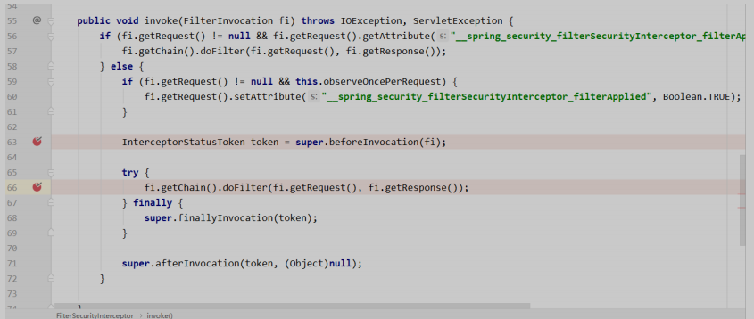

super.beforeInvocation(fi) 表示查看之前的 filter 是否通过。

fi.getChain().doFilter(fi.getRequest(), fi.getResponse());表示真正的调用后台的服务。

ExceptionTranslationFilter：是个异常过滤器，用来处理在认证授权过程中抛出的异常

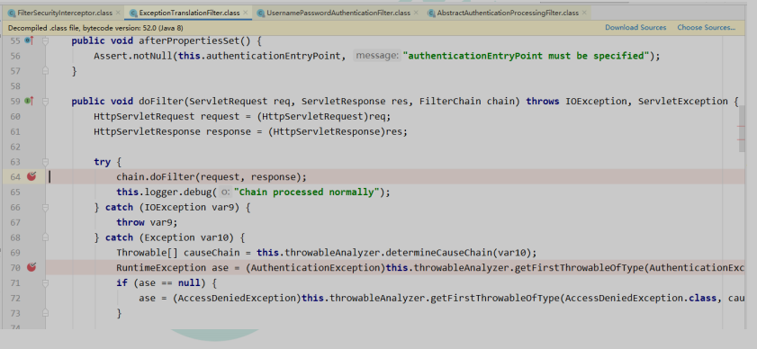

UsernamePasswordAuthenticationFilter ：对/login 的 POST 请求做拦截，校验表单中用户名，密码。

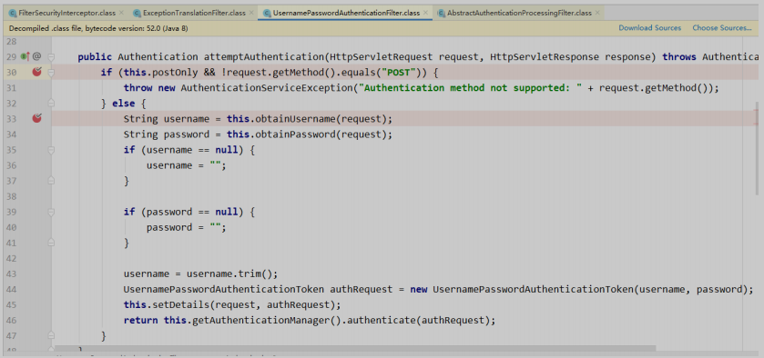

### **2.6 UserDetailsService** **接口讲解**

当什么也没有配置的时候，账号和密码是由 Spring Security 定义生成的。而在实际项目中账号和密码都是从数据库中查询出来的。 所以我们要通过自定义逻辑控制认证逻辑。

如果需要自定义逻辑时，只需要实现 UserDetailsService 接口即可。接口定义如下：

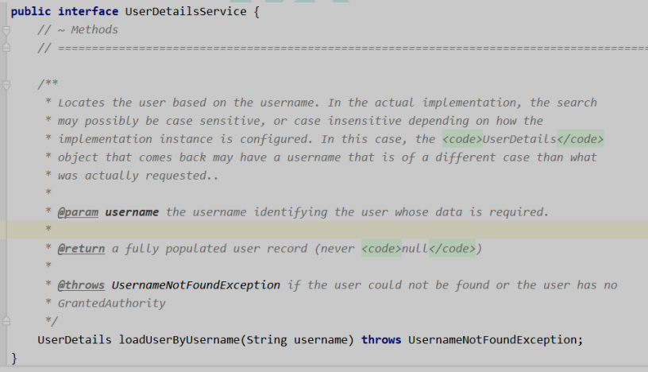

⚫ **返回值** **UserDetails** 

这个类是系统默认的用户“**主体**”

```java
// 表示获取登录用户所有权限
Collection<? extends GrantedAuthority> getAuthorities();
// 表示获取密码
String getPassword();
// 表示获取用户名
String getUsername();
// 表示判断账户是否过期
boolean isAccountNonExpired();
// 表示判断账户是否被锁定
boolean isAccountNonLocked();
// 表示凭证{密码}是否过期
boolean isCredentialsNonExpired();
// 表示当前用户是否可用
boolean isEnabled();
```

以下是 UserDetails 实现类

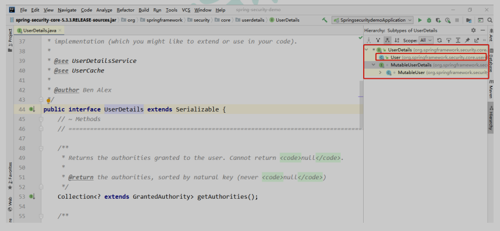

以后我们只需要使用 User 这个实体类即可！

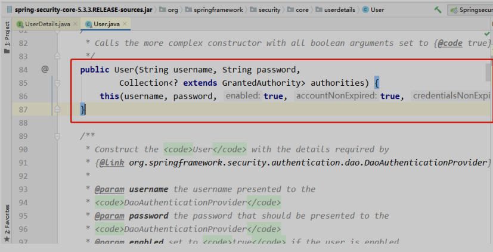

⚫ **方法参数** **username**

表示用户名。此值是客户端表单传递过来的数据。默认情况下必须叫 username，否则无法接收。

### **2.7 PasswordEncoder** **接口讲解**

```java
// 表示把参数按照特定的解析规则进行解析
String encode(CharSequence rawPassword);
// 表示验证从存储中获取的编码密码与编码后提交的原始密码是否匹配。如果密码匹
配，则返回 true；如果不匹配，则返回 false。第一个参数表示需要被解析的密码。第二个
参数表示存储的密码。
boolean matches(CharSequence rawPassword, String encodedPassword);
// 表示如果解析的密码能够再次进行解析且达到更安全的结果则返回 true，否则返回
false。默认返回 false。
default boolean upgradeEncoding(String encodedPassword) {
return false; }
```

接口实现类

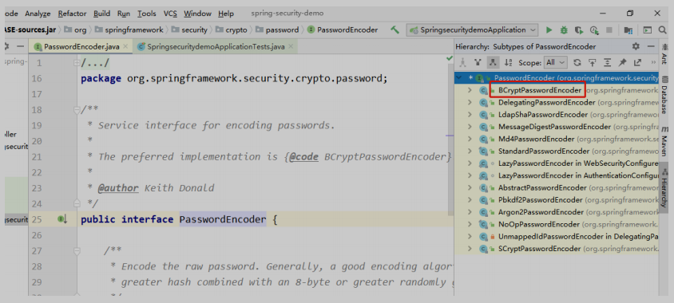

BCryptPasswordEncoder 是 Spring Security 官方推荐的密码解析器，平时多使用这个解析器。

BCryptPasswordEncoder 是对 bcrypt 强散列方法的具体实现。是基于 Hash 算法实现的单向加密。可以通过 strength 控制加密强度，默认 10.

⚫ **查用方法演示**

```java
@Test
public void test01(){
// 创建密码解析器
BCryptPasswordEncoder bCryptPasswordEncoder = new 
BCryptPasswordEncoder();
// 对密码进行加密
String atguigu = bCryptPasswordEncoder.encode("atguigu");
// 打印加密之后的数据
System.out.println("加密之后数据：\t"+atguigu);
//判断原字符加密后和加密之前是否匹配
boolean result = bCryptPasswordEncoder.matches("atguigu", atguigu);
// 打印比较结果
System.out.println("比较结果：\t"+result);
}
```

### **2.8 SpringBoot** **对** **Security** **的自动配置**

https://docs.spring.io/spring-security/site/docs/5.3.4.RELEASE/reference/html5/#servlet-hello

## **3. SpringSecurity Web** **权限方案**

### **3.1** **设置登录系统的账号、密码**

**方式一：在** **application.properties**

```properties
spring.security.user.name=atguigu
spring.security.user.password=atguigu
```

**方式二：编写类实现接口**

```java
package com.atguigu.config;
@Configuration
public class SecurityConfig {
// 注入 PasswordEncoder 类到 spring 容器中
@Bean
public PasswordEncoder passwordEncoder(){
return new BCryptPasswordEncoder();
 } }
```

```java
package com.atguigu.service;
@Service
public class LoginService implements UserDetailsService {
@Override
public UserDetails loadUserByUsername(String username) throws 
UsernameNotFoundException {
// 判断用户名是否存在
if (!"admin".equals(username)){
throw new UsernameNotFoundException("用户名不存在！");
    }
// 从数据库中获取的密码 atguigu 的密文
String pwd = 
"$2a$10$2R/M6iU3mCZt3ByG7kwYTeeW0w7/UqdeXrb27zkBIizBvAven0/na";
// 第三个参数表示权限
return new User(username,pwd, 
AuthorityUtils.commaSeparatedStringToAuthorityList("admin,"));
 } }
```

### **3.2** **实现数据库认证来完成用户登录**

完成自定义登录

#### **3.2.1** **准备** **sql**

```sql
create table users(
 id bigint primary key auto_increment,
username varchar(20) unique not null,
password varchar(100)
);
-- 密码 atguigu
insert into users values(1,'张
san','$2a$10$2R/M6iU3mCZt3ByG7kwYTeeW0w7/UqdeXrb27zkBIizBvAven0/na');
-- 密码 atguigu
insert into users values(2,'李
si','$2a$10$2R/M6iU3mCZt3ByG7kwYTeeW0w7/UqdeXrb27zkBIizBvAven0/na');
create table role(
id bigint primary key auto_increment,
name varchar(20)
);
insert into role values(1,'管理员');
insert into role values(2,'普通用户');
create table role_user(
uid bigint,
rid bigint
);
insert into role_user values(1,1);
insert into role_user values(2,2);
create table menu(
id bigint primary key auto_increment,
name varchar(20),
url varchar(100),
parentid bigint,
permission varchar(20)
);
insert into menu values(1,'系统管理','',0,'menu:system');
insert into menu values(2,'用户管理','',0,'menu:user');
create table role_menu(
mid bigint,
rid bigint
);
insert into role_menu values(1,1);
insert into role_menu values(2,1);
insert into role_menu values(2,2);
```

#### **3.2.2** **添加依赖**

```xml
<dependencies>
 <dependency>
 <groupId>org.springframework.boot</groupId>
 <artifactId>spring-boot-starter-web</artifactId>
 </dependency>
 <dependency>
 <groupId>org.springframework.boot</groupId>
 <artifactId>spring-boot-starter-security</artifactId>
 </dependency>
 <dependency>
 <groupId>org.springframework.boot</groupId>
 <artifactId>spring-boot-starter-test</artifactId>
 <scope>test</scope>
 </dependency>
 <!--mybatis-plus-->
 <dependency>
 <groupId>com.baomidou</groupId>
 <artifactId>mybatis-plus-boot-starter</artifactId>
 <version>3.0.5</version>
 </dependency>
 <!--mysql-->
 <dependency>
 <groupId>mysql</groupId>
 <artifactId>mysql-connector-java</artifactId>
 </dependency>
 <!--lombok 用来简化实体类-->
 <dependency>
 <groupId>org.projectlombok</groupId>
 <artifactId>lombok</artifactId>
 </dependency>
</dependencies>
```

#### **3.2.3** **制作实体类**

```java
@Data
public class Users {
    private Integer id;
 private String username;
 private String password; }
```

#### **3.2.4** **整合** **MybatisPlus** **制作** **mapper**

```java
@Repository
public interface UsersMapper extends BaseMapper<Users> {
}
```

```properties
#配置文件添加数据库配置 
#mysql 数据库连接
spring.datasource.driver-class-name=com.mysql.cj.jdbc.Driver 
spring.datasource.url=jdbc:mysql://localhost:3306/demo?serverTimezone=GMT%2B8 
spring.datasource.username=root 
spring.datasource.password=root
```

#### **3.2.5** **制作登录实现类**

```java
@Service("userDetailsService")
public class MyUserDetailsService implements UserDetailsService {
 @Autowired
 private UsersMapper usersMapper;
 @Override
 public UserDetails loadUserByUsername(String s) throws UsernameNotFoundException {
 QueryWrapper<Users> wrapper = new QueryWrapper();
 wrapper.eq("username",s);
 Users users = usersMapper.selectOne(wrapper);
 if(users == null) {
 throw new UsernameNotFoundException("用户名不存在！");
 }
 System.out.println(users);
 List<GrantedAuthority> auths =
 AuthorityUtils.commaSeparatedStringToAuthorityList("role");
 return new User(users.getUsername(),
 new BCryptPasswordEncoder().encode(users.getPassword()),auths);
 } }
```

#### **3.2.6** **测试访问**


输入用户名，密码

### **3.3** **未认证请求跳转到登录页**

#### **3.3.1** **引入前端模板依赖**

```xml
<dependency> <groupId>org.springframework.boot</groupId> <artifactId>spring-boot-starter-thymeleaf</artifactId>
</dependency>
```

#### **3.3.2** **引入登录页面**

将准备好的登录页面导入项目中

#### **3.3.3** **编写控制器**

```java
@Controller
public class IndexController {
@GetMapping("index")
public String index(){
return "login";
 }
@GetMapping("findAll")
@ResponseBody
public String findAll(){
return "findAll";
 }
    }
```

#### **3.3.4** **编写配置类放行登录页面以及静态资源**

```java
@Configuration
public class SecurityConfig extends WebSecurityConfigurerAdapter {
// 注入 PasswordEncoder 类到 spring 容器中
@Bean
public PasswordEncoder passwordEncoder(){
return new BCryptPasswordEncoder();
 }
@Override
protected void configure(HttpSecurity http) throws Exception {
 http.authorizeRequests()
 .antMatchers("/layui/**","/index") //表示配置请求路径
.permitAll() // 指定 URL 无需保护。
.anyRequest() // 其他请求
.authenticated(); //需要认证
}}
```

#### **3.3.5** **测试**

访问 localhost:8090/index

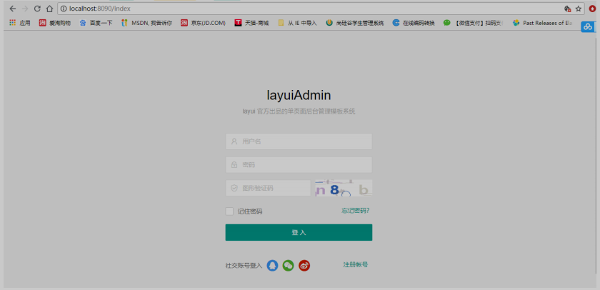

访问 localhost:8090/findAll 会提示 403 错误 表示没有这个权限。

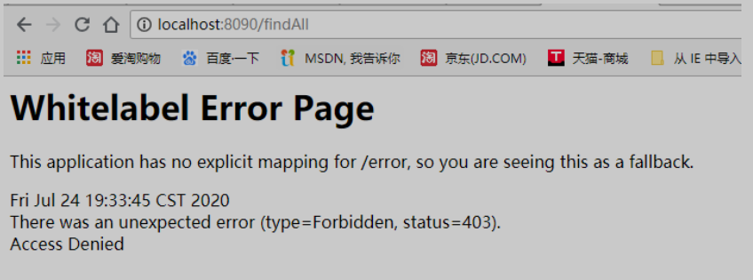

#### **3.3.6** **设置未授权的请求跳转到登录页**

配置类

```java
@Override
protected void configure(HttpSecurity http) throws Exception {
// 配置认证
http.formLogin()
 .loginPage("/index") // 配置哪个 url 为登录页面
.loginProcessingUrl("/login") // 设置哪个是登录的 url。
.successForwardUrl("/success") // 登录成功之后跳转到哪个 url
.failureForwardUrl("/fail");// 登录失败之后跳转到哪个 url
http.authorizeRequests()
 .antMatchers("/layui/**","/index") //表示配置请求路径
.permitAll() // 指定 URL 无需保护。
.anyRequest() // 其他请求
.authenticated(); //需要认证
// 关闭 csrf
http.csrf().disable();
}
```

控制器

```java
@PostMapping("/success")
public String success(){
return "success"; }
@PostMapping("/fail")
public String fail(){
return "fail";
    }
```

```html
<form action="/login"method="post">
用户名:<input type="text"name="username"/><br/>
密码：<input type="password"name="password"/><br/>
<input type="submit"value="提交"/>
</form>
```

**注意：页面提交方式必须为** **post** **请求，所以上面的页面不能使用，用户名，密码必须为****username,password**

**原因：**

**在执行登录的时候会走一个过滤器** UsernamePasswordAuthenticationFilter

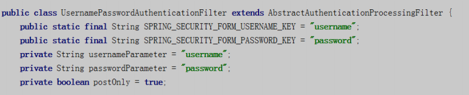

如果修改配置可以调用 usernameParameter()和 passwordParameter()方法。

```html
<form action="/login"method="post">
用户名:<input type="text"name="loginAcct"/><br/>
密码：<input type="password"name="userPswd"/><br/>
<input type="submit"value="提交"/>
</form>
```

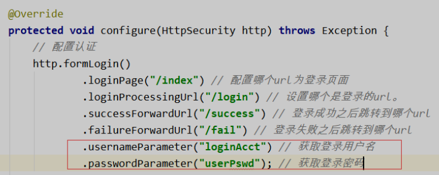

### **3.4** **基于角色或权限进行访问控制**

#### **3.4.1 hasAuthority** **方法**

如果当前的主体具有指定的权限，则返回 true,否则返回 false

⚫ 修改配置类

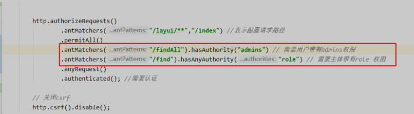

⚫ 添加一个控制器

```java
@GetMapping("/find")
@ResponseBody
public String find(){
return "find"; }
```

⚫ 给用户登录主体赋予权限

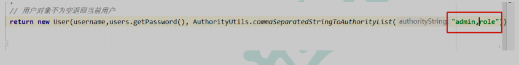

⚫ 测试：

http://localhost:8090/findAll

访问 findAll 进入登录页面

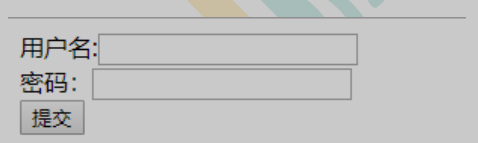

认证完成之后返回登录成功

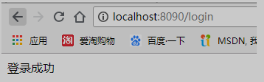

#### **3.4.2 hasAnyAuthority** **方法**

如果当前的主体有任何提供的角色（给定的作为一个逗号分隔的字符串列表）的话，返回true.

访问 http://localhost:8090/find

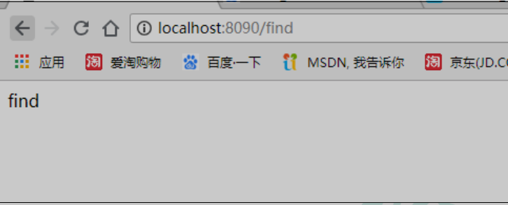

#### **3.4.3 hasRole** **方法**

如果用户具备给定角色就允许访问,否则出现 403。

如果当前主体具有指定的角色，则返回 true。

底层源码：

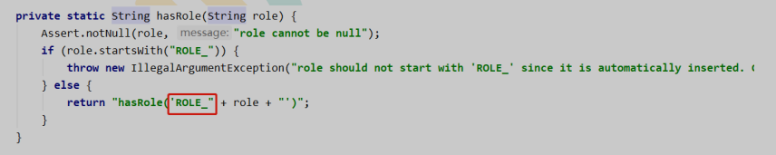

给用户添加角色：


修改配置文件：

注意配置文件中不需要添加”ROLE_“，因为上述的底层代码会自动添加与之进行匹配。

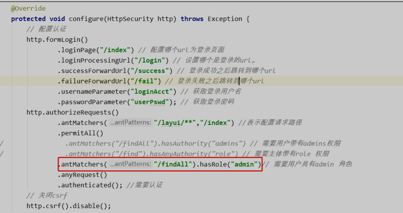

#### **3.4.4 hasAnyRole**

表示用户具备任何一个条件都可以访问。

给用户添加角色：

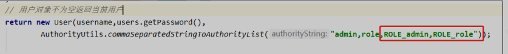

修改配置文件：

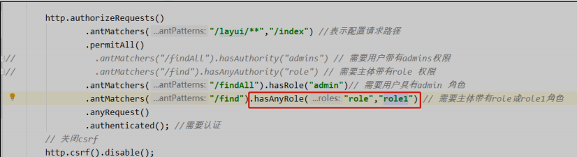

### **3.5** **基于数据库实现权限认证**

#### **3.5.1** **添加实体类**

```java
@Data
public class Menu {
private Long id;
private String name;
private String url;
private Long parentId;
private String permission; }
```

```java
@Data
public class Role {
private Long id;
private String name; }
```

#### **3.5.2** **编写接口与实现类**

UserInfoMapper

```java
/**
* 根据用户 Id 查询用户角色
* @param userId
* @return
*/
List<Role> selectRoleByUserId(Long userId);
/**
* 根据用户 Id 查询菜单
* @param userId
* @return
*/
List<Menu> selectMenuByUserId(Long userId);
```

上述接口需要进行多表管理查询：

需要在 resource/mapper 目录下自定义 UserInfoMapper.xml 

```xml
<?xml version="1.0"encoding="utf-8"?>
<!DOCTYPEmapperPUBLIC"-//mybatis.org//DTD Mapper 
3.0//EN""http://mybatis.org/dtd/mybatis-3-mapper.dtd"> <mapper namespace="com.atguigu.mapper.UserInfoMapper">
    <!--根据用户 Id 查询角色信息--> <select id="selectRoleByUserId"resultType="com.atguigu.bean.Role">
 SELECT r.id,r.name FROM role r INNER JOIN role_user ru ON 
ru.rid=r.id where ru.uid=#{0}
</select>
<!--根据用户 Id 查询权限信息--> <select id="selectMenuByUserId"resultType="com.atguigu.bean.Menu">
 SELECT m.id,m.name,m.url,m.parentid,m.permission FROM menu m
 INNER JOIN role_menu rm ON m.id=rm.mid
INNER JOIN role r ON r.id=rm.rid
INNER JOIN role_user ru ON r.id=ru.rid
WHERE ru.uid=#{0}
</select>
</mapper>
```

UsersServiceImpl

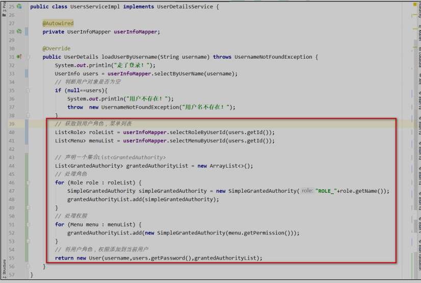

#### **3.5.3** **在配置文件中添加映射**

在配置文件中 application.yml 添加

```yaml
mybatis:
mapper-locations: classpath:mapper/*.xml
```

#### **3.5.4** **修改访问配置类**

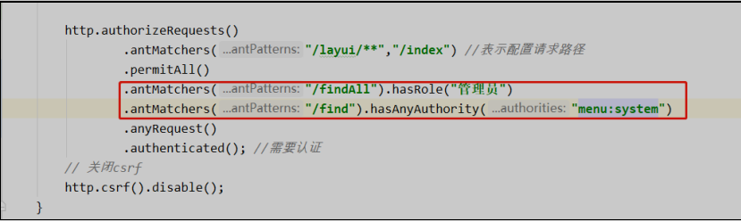

#### **3.5.5** **使用管理员与非管理员进行测试**

如果非管理员测试会提示 403 没有权限

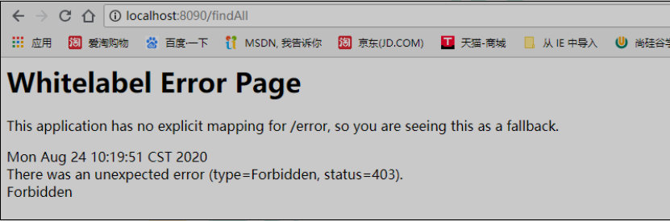

### **3.6** **自定义** **403** **页面**

#### **3.6.1** **修改访问配置类**

```java
http.exceptionHandling().accessDeniedPage("/unauth");
```

#### **3.6.2** **添加对应控制器**

```java
@GetMapping("/unauth")
public String accessDenyPage(){
return "unauth"; }
```

**unauth.html**

```html
<body> <h1>对不起，您没有访问权限！</h1>
    </body>
```

#### **3.6.3** **测试**

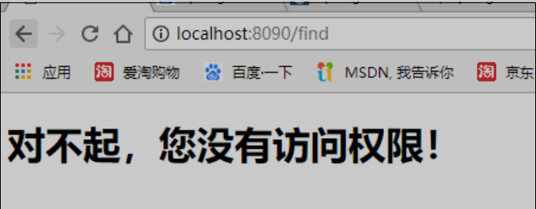

### **3.7** **注解使用**

#### **3.7.1 @Secured**

判断是否具有角色，另外需要注意的是这里匹配的字符串需要添加前缀“ROLE_“。

使用注解先要开启注解功能！

**@EnableGlobalMethodSecurity(securedEnabled=true)**

```java
@SpringBootApplication
@EnableGlobalMethodSecurity(securedEnabled=true)
public class DemosecurityApplication {
public static void main(String[] args) {
 SpringApplication.run(DemosecurityApplication.class, args);
 } }
```

在控制器方法上添加注解

```java
// 测试注解：
@RequestMapping("testSecured")
@ResponseBody
@Secured({"ROLE_normal","ROLE_admin"})
public String helloUser() {
return "hello,user"; }
@Secured({"ROLE_normal","ROLE_管理员"})
```

登录之后直接访问：http://localhost:8090/testSecured 控制器

将上述的角色改为 @Secured({**"ROLE_normal"**,**"ROLE_****管理员****"**})即可访问

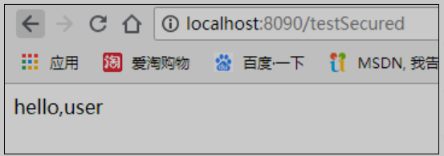

#### **3.7.2 @PreAuthorize**

先开启注解功能：

@EnableGlobalMethodSecurity(prePostEnabled = **true**)

@PreAuthorize：注解适合进入方法前的权限验证， @PreAuthorize 可以将登录用户的 roles/permissions 参数传到方法中。

```java
@RequestMapping("/preAuthorize")
@ResponseBody
//@PreAuthorize("hasRole('ROLE_管理员')")
@PreAuthorize("hasAnyAuthority('menu:system')")
public String preAuthorize(){
 System.out.println("preAuthorize");
return "preAuthorize"; }
```

使用李四登录测试：

#### **3.7.3 @PostAuthorize**

先开启注解功能：

@EnableGlobalMethodSecurity(prePostEnabled = **true**)

@PostAuthorize 注解使用并不多，在方法执行后再进行权限验证，适合验证带有返回值的权限.

```java
@RequestMapping("/testPostAuthorize")
@ResponseBody
@PostAuthorize("hasAnyAuthority('menu:system')")
public String preAuthorize(){
 System.out.println("test--PostAuthorize");
return "PostAuthorize"; }
```

使用李四登录测试：

#### **3.7.4 @PostFilter**

@PostFilter ：权限验证之后对数据进行过滤 留下用户名是 admin1 的数据

表达式中的 filterObject 引用的是方法返回值 List 中的某一个元素

```java
@RequestMapping("getAll")
@PreAuthorize("hasRole('ROLE_管理员')")
@PostFilter("filterObject.username == 'admin1'")
@ResponseBody
public List<UserInfo> getAllUser(){
 ArrayList<UserInfo> list = new ArrayList<>();
 list.add(new UserInfo(1l,"admin1","6666"));
 list.add(new UserInfo(2l,"admin2","888"));
return list;
}
```

#### **3.7.5 @PreFilter**

@PreFilter: 进入控制器之前对数据进行过滤

```java
@RequestMapping("getTestPreFilter")
@PreAuthorize("hasRole('ROLE_管理员')")
@PreFilter(value = "filterObject.id%2==0")
@ResponseBody
public List<UserInfo> getTestPreFilter(@RequestBody List<UserInfo> 
list){
 list.forEach(t-> {
 System.out.println(t.getId()+"\t"+t.getUsername());
 });
return list;
}
```

先登录，然后使用 postman 进行测试

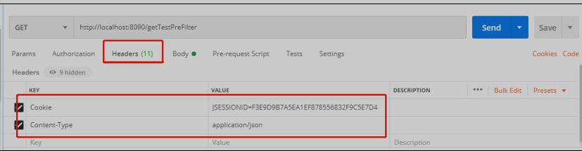

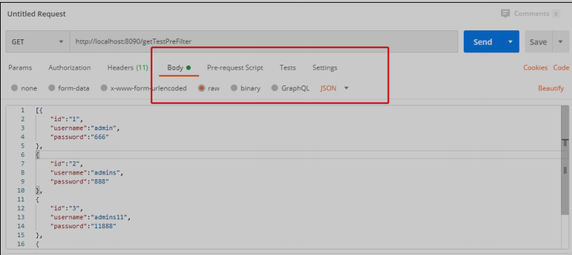

测试的 Json 数据：

```json
[{
"id": "1",
"username": "admin",
"password": "666"
},{
"id": "2",
"username": "admins",
"password": "888"
},{
"id": "3",
"username": "admins11",
"password": "11888"
},{
"id": "4",
"username": "admins22",
"password": "22888"
    }]
```

#### **3.7.6** **权限表达式**

https://docs.spring.io/spring-security/site/docs/5.3.4.RELEASE/reference/html5/#el-access

### **3.8** **基于数据库的记住我**

#### **3.8.1** **创建表**

```sql
CREATE TABLE `persistent_logins` (
 `username` varchar(64) NOT NULL,
 `series` varchar(64) NOT NULL,
 `token` varchar(64) NOT NULL,
 `last_used` timestamp NOT NULL DEFAULT CURRENT_TIMESTAMP ON UPDATE 
CURRENT_TIMESTAMP,
 PRIMARY KEY (`series`)
) ENGINE=InnoDB DEFAULT CHARSET=utf8;
```

#### **3.8.2** **添加数据库的配置文件**

```yaml
spring:
datasource:
driver-class-name: com.mysql.jdbc.Driver
url: jdbc:mysql://192.168.200.128:3306/test
username: root
password: root
```

#### **3.8.3** **编写配置类**

创建配置类

```java
@Configuration
public class BrowserSecurityConfig {
    @Autowired
private DataSource dataSource;
@Bean
public PersistentTokenRepository persistentTokenRepository(){
 JdbcTokenRepositoryImpl jdbcTokenRepository = new 
JdbcTokenRepositoryImpl();
// 赋值数据源
jdbcTokenRepository.setDataSource(dataSource);
// 自动创建表,第一次执行会创建，以后要执行就要删除掉！
jdbcTokenRepository.setCreateTableOnStartup(true);
return jdbcTokenRepository;
 } }
```

#### **3.8.4** **修改安全配置类**

```java
@Autowired
private UsersServiceImpl usersService;
@Autowired
private PersistentTokenRepository tokenRepository;
// 开启记住我功能
http.rememberMe()
 .tokenRepository(tokenRepository)
 .userDetailsService(usersService);
```

#### **3.8.5** **页面添加记住我复选框**

```html
记住我：<input type="checkbox"name="remember-me"title="记住密码"/><br/>
```

此处：name 属性值必须位 remember-me.不能改为其他值

#### **3.8.6** **使用张三进行登录测试**

登录成功之后，关闭浏览器再次访问 http://localhost:8090/find，发现依然可以使用！

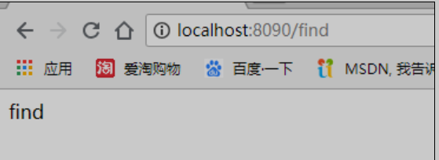

#### **3.8.7** **设置有效期**

默认 2 周时间。但是可以通过设置状态有效时间，即使项目重新启动下次也可以正常登录。

在配置文件中设置

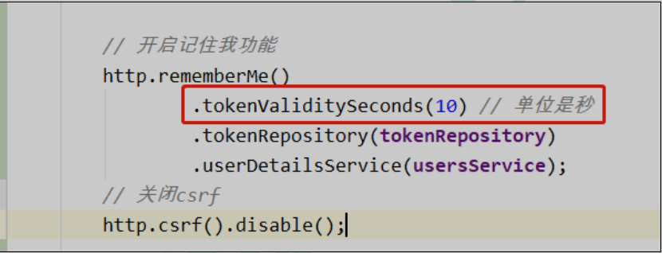

### **3.9** **用户注销**

#### **3.9.1** **在登录页面添加一个退出连接**

success.html

```html
<body>
登录成功<br> <a href="/logout">退出</a>
</body>
```

#### **3.9.2** **在配置类中添加退出映射地址**

```java
http.logout().logoutUrl("/logout").logoutSuccessUrl("/index").permitAll();
```

#### **3.9.3** **测试**

退出之后，是无法访问需要登录时才能访问的控制器！

### **3.10 CSRF** 

#### **3.10.1 CSRF** **理解**

**跨站请求伪造**（英语：Cross-site request forgery），也被称为 **one-click** **attack** 或者 **session riding**，通常缩写为 **CSRF** 或者 **XSRF**， 是一种挟制用户在当前已登录的 Web 应用程序上执行非本意的操作的攻击方法。跟跨网站脚本（XSS）相比，**XSS**利用的是用户对指定网站的信任，CSRF 利用的是网站对用户网页浏览器的信任。

跨站请求攻击，简单地说，是攻击者通过一些技术手段欺骗用户的浏览器去访问一个自己曾经认证过的网站并运行一些操作（如发邮件，发消息，甚至财产操作如转账和购买商品）。由于浏览器曾经认证过，所以被访问的网站会认为是真正的用户操作而去运行。这利用了 web 中用户身份验证的一个漏洞：**简单的身份验证只能保证请求发自某个用户的****浏览器，却不能保证请求本身是用户自愿发出的**。 

从 Spring Security 4.0 开始，默认情况下会启用 CSRF 保护，以防止 CSRF 攻击应用程序，Spring Security CSRF 会针对 PATCH，POST，PUT 和 DELETE 方法进行防护。

#### **3.10.2** **案例**

在登录页面添加一个隐藏域：

```html
<input 
type="hidden"th:if="${_csrf}!=null"th:value="${_csrf.token}"name="_csrf
"/>
```

关闭安全配置的类中的 csrf

```java
// http.csrf().disable();
```

#### **3.10.3 Spring Security** **实现** **CSRF** **的原理：**

\1. 生成 csrfToken 保存到 HttpSession 或者 Cookie 中。

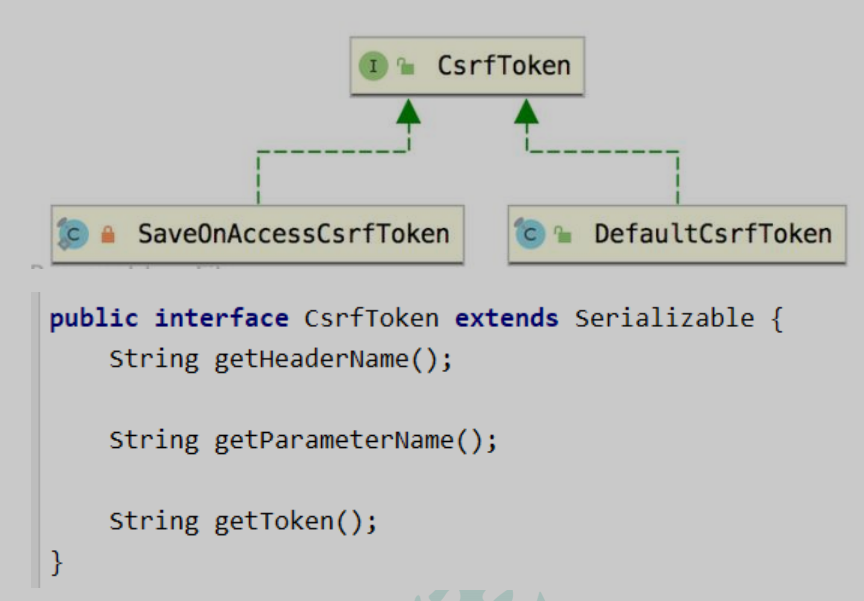

SaveOnAccessCsrfToken 类有个接口 CsrfTokenRepository

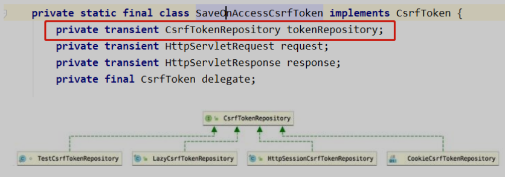

当前接口实现类：HttpSessionCsrfTokenRepository，CookieCsrfTokenRepository

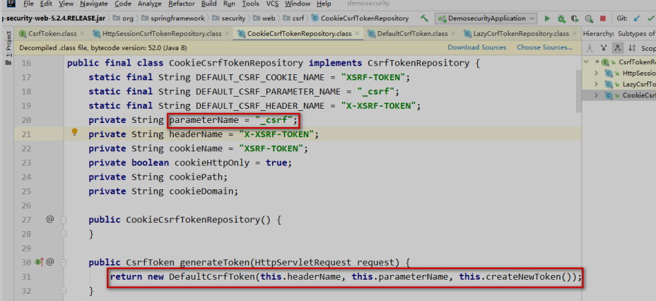

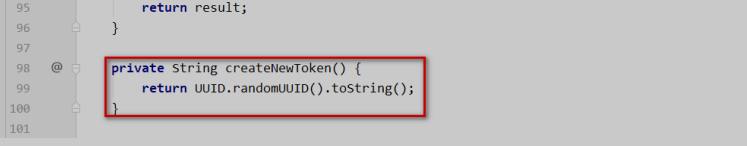

\2. 请求到来时，从请求中提取 csrfToken，和保存的 csrfToken 做比较，进而判断当前请求是否合法。主要通过 CsrfFilter 过滤器来完成。


## **4. SpringSecurity** **微服务权限方案**

### **4.1** **什么是微服务**

**1、微服务由来** 

微服务最早由 Martin Fowler 与 James Lewis 于 2014 年共同提出，微服务架构风格是一种使用一套小服务来开发单个应用的方式途径，每个服务运行在自己的进程中，并使用轻量级机制通信，通常是 HTTP API，这些服务基于业务能力构建，并能够通过自动化部署机制来独立部署，这些服务使用不同的编程语言实现，以及不同数据存储技术，并保持最低限度的集中式管理。 

**2、微服务优势** 

（1）微服务每个模块就相当于一个单独的项目，代码量明显减少，遇到问题也相对来说比较好解决。

（2）微服务每个模块都可以使用不同的存储方式（比如有的用 redis，有的用 mysql等），数据库也是单个模块对应自己的数据库。

（3）微服务每个模块都可以使用不同的开发技术，开发模式更灵活。 

**3、微服务本质** 

（1）微服务，关键其实不仅仅是微服务本身，而是系统要提供一套基础的架构，这种架构使得微服务可以独立的部署、运行、升级，不仅如此，这个系统架构还让微服务与微服务之间在结构上“松耦合”，而在功能上则表现为一个统一的整体。这种所谓的“统一的整体”表现出来的是统一风格的界面，统一的权限管理，统一的安全策略，统一的上线过程，统一的日志和审计方法，统一的调度方式，统一的访问入口等等。

（2）微服务的目的是有效的拆分应用，实现敏捷开发和部署。

### **4.2** **微服务认证与授权实现思路**

**1****、认证授权过程分析**

（1）如果是基于 Session，那么 Spring-security 会对 cookie 里的 sessionid 进行解析，找到服务器存储的 session 信息，然后判断当前用户是否符合请求的要求。

（2）如果是 token，则是解析出 token，然后将当前请求加入到 Spring-security 管理的权限

信息中去

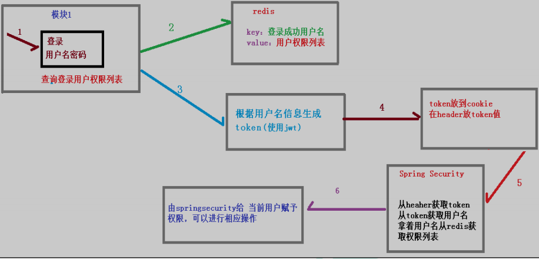

如果系统的模块众多，每个模块都需要进行授权与认证，所以我们选择基于 token 的形式进行授权与认证，用户根据用户名密码认证成功，然后获取当前用户角色的一系列权限值，并以用户名为 key，权限列表为 value 的形式存入 redis 缓存中，根据用户名相关信息生成 token 返回，浏览器将 token 记录到 cookie 中，每次调用 api 接口都默认将 token 携带到 header 请求头中，Spring-security 解析 header 头获取 token 信息，解析 token 获取当前用户名，根据用户名就可以从 redis 中获取权限列表，这样 Spring-security 就能够判断当前请求是否有权限访问

**2****、权限管理数据模型**

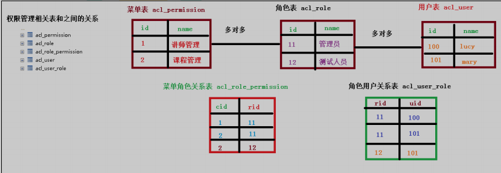

### **4.3 jwt** **介绍**

**1****、访问令牌的类型**

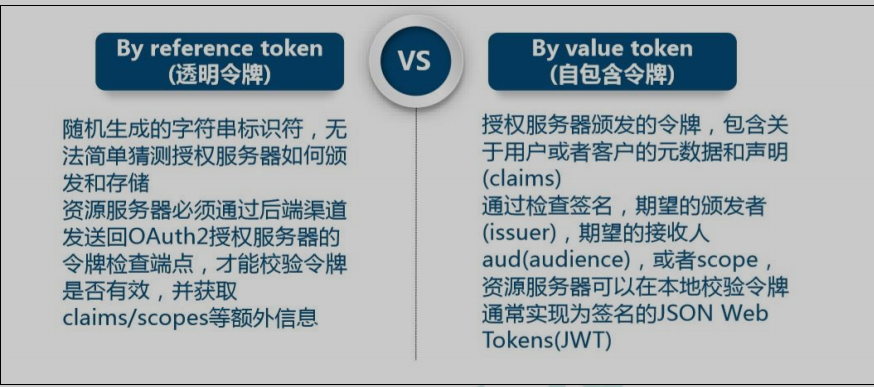

**2****、****JWT** **的组成**

典型的，一个 JWT 看起来如下图：

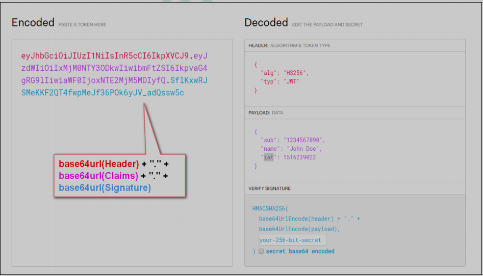

该对象为一个很长的字符串，字符之间通过"."分隔符分为三个子串。

每一个子串表示了一个功能块，总共有以下三个部分：JWT 头、有效载荷和签名

**JWT 头**

JWT 头部分是一个描述 JWT 元数据的 JSON 对象，通常如下所示。

{

"alg": "HS256",

"typ": "JWT"

}

在上面的代码中，alg 属性表示签名使用的算法，默认为 HMAC SHA256（写为 HS256）；typ 属性表示令牌的类型，JWT 令牌统一写为 JWT。最后，使用 Base64 URL 算法将上述JSON 对象转换为字符串保存。

**有效载荷**

有效载荷部分，是 JWT 的主体内容部分，也是一个 JSON 对象，包含需要传递的数据。 JWT指定七个默认字段供选择。

iss：发行人

exp：到期时间

sub：主题

aud：用户

nbf：在此之前不可用

iat：发布时间

jti：JWT ID 用于标识该 JWT

除以上默认字段外，我们还可以自定义私有字段，如下例：

{

"sub": "1234567890",

"name": "Helen",

"admin": true

}

请注意，默认情况下 JWT 是未加密的，任何人都可以解读其内容，因此不要构建隐私信息字段，存放保密信息，以防止信息泄露。

JSON 对象也使用 Base64 URL 算法转换为字符串保存。

**签名哈希**

签名哈希部分是对上面两部分数据签名，通过指定的算法生成哈希，以确保数据不会被篡改。

首先，需要指定一个密码（secret）。该密码仅仅为保存在服务器中，并且不能向用户公开。然后，使用标头中指定的签名算法（默认情况下为 HMAC SHA256）根据以下公式生成签名。

HMACSHA256(base64UrlEncode(header) + "." + base64UrlEncode(claims), secret)

在计算出签名哈希后，JWT 头，有效载荷和签名哈希的三个部分组合成一个字符串，每个部分用"."分隔，就构成整个 JWT 对象。

**Base64URL 算法**

如前所述，JWT 头和有效载荷序列化的算法都用到了 Base64URL。该算法和常见 Base64 算法类似，稍有差别。

作为令牌的 JWT 可以放在 URL 中（例如 api.example/?token=xxx）。 Base64 中用的三个字符是"+"，"/"和"="，由于在 URL 中有特殊含义，因此 Base64URL 中对他们做了替换："="去掉，"+"用"-"替换，"/"用"_"替换，这就是 Base64URL 算法。

### **4.4** **具体代码实现**

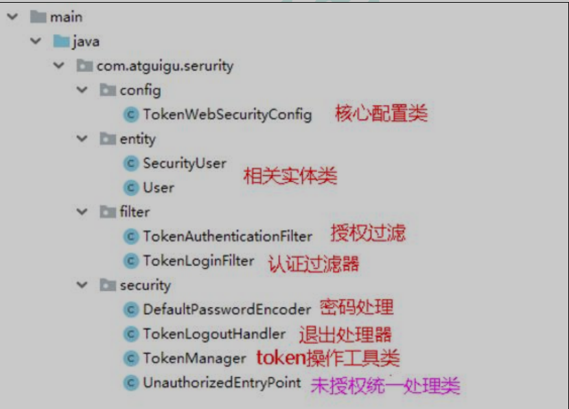

#### **4.3.1** **编写核心配置类**

Spring Security 的核心配置就是继承 WebSecurityConfigurerAdapter 并注解@EnableWebSecurity 的配置。这个配置指明了用户名密码的处理方式、请求路径、登录登出控制等和安全相关的配置

```java
@Configuration
@EnableWebSecurity
@EnableGlobalMethodSecurity(prePostEnabled = true)
public class TokenWebSecurityConfig extends WebSecurityConfigurerAdapter {
 //自定义查询数据库用户名密码和权限信息
 private UserDetailsService userDetailsService;
 //token 管理工具类（生成 token）
 private TokenManager tokenManager;
 //密码管理工具类
 private DefaultPasswordEncoder defaultPasswordEncoder;
 //redis 操作工具类
 private RedisTemplate redisTemplate;
 @Autowired
 public TokenWebSecurityConfig(UserDetailsService userDetailsService, 
DefaultPasswordEncoder defaultPasswordEncoder,
 TokenManager tokenManager, RedisTemplate 
redisTemplate) {
 this.userDetailsService = userDetailsService;
 this.defaultPasswordEncoder = defaultPasswordEncoder;
 this.tokenManager = tokenManager;
 this.redisTemplate = redisTemplate;
 }
 /**
 * 配置设置
 */
 //设置退出的地址和 token，redis 操作地址
 @Override
 protected void configure(HttpSecurity http) throws Exception {
 http.exceptionHandling()
 .authenticationEntryPoint(new UnauthorizedEntryPoint())
 .and().csrf().disable()
 .authorizeRequests()
 .anyRequest().authenticated()
 .and().logout().logoutUrl("/admin/acl/index/logout")
 .addLogoutHandler(new 
TokenLogoutHandler(tokenManager,redisTemplate)).and()
 .addFilter(new TokenLoginFilter(authenticationManager(), 
tokenManager, redisTemplate))
 .addFilter(new 
TokenAuthenticationFilter(authenticationManager(), tokenManager, 
redisTemplate)).httpBasic();
 }
 /**
 * 密码处理
 */
 @Override
 public void configure(AuthenticationManagerBuilder auth) throws Exception 
{
 
auth.userDetailsService(userDetailsService).passwordEncoder(defaultPasswordEnc
oder);
 }
 /**
 * 配置哪些请求不拦截
 */
 @Override
 public void configure(WebSecurity web) throws Exception {
 web.ignoring().antMatchers("/api/**" , "/swagger-ui.html/**);
 } }
```

#### **4.3.2** **创建认证授权相关的工具类**

 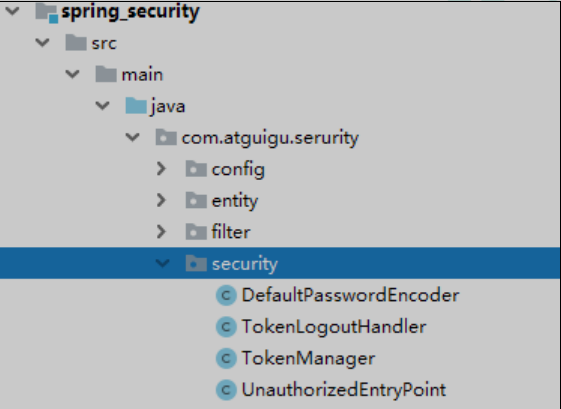

**（****1）DefaultPasswordEncoder：密码处理的方法**

```java
@Component
public class DefaultPasswordEncoder implements PasswordEncoder {
 public DefaultPasswordEncoder() {
 this(-1);
 }
 /**
 * @param strength 
 * the log rounds to use, between 4 and 31
 */
 public DefaultPasswordEncoder(int strength) {
     }
 public String encode(CharSequence rawPassword) {
 return MD5.encrypt(rawPassword.toString());
 }
 public boolean matches(CharSequence rawPassword, String encodedPassword) {
 return encodedPassword.equals(MD5.encrypt(rawPassword.toString()));
 } }
```

**（**2）TokenManager：token 操作的工具类**

```java
@Component
public class TokenManager {
 private long tokenExpiration = 24*60*60*1000;
 private String tokenSignKey = "123456";
 public String createToken(String username) {
 String token = Jwts.builder().setSubject(username)
 .setExpiration(new Date(System.currentTimeMillis() + 
tokenExpiration))
 .signWith(SignatureAlgorithm.HS512, 
tokenSignKey).compressWith(CompressionCodecs.GZIP).compact();
 return token;
 }
 public String getUserFromToken(String token) {
 String user = 
Jwts.parser().setSigningKey(tokenSignKey).parseClaimsJws(token).getBody().getSu
bject();
 return user;
 }
 public void removeToken(String token) {
 //jwttoken 无需删除，客户端扔掉即可。
 } }
```

**（**3）TokenLogoutHandler：退出实现** 

```java
public class TokenLogoutHandler implements LogoutHandler {
 private TokenManager tokenManager;
 private RedisTemplate redisTemplate;
 public TokenLogoutHandler(TokenManager tokenManager, RedisTemplate 
redisTemplate) {
 this.tokenManager = tokenManager;
 this.redisTemplate = redisTemplate;
 }
 @Override
 public void logout(HttpServletRequest request, HttpServletResponse 
response, Authentication authentication) {
 String token = request.getHeader("token");
 if (token != null) {
 tokenManager.removeToken(token);
 //清空当前用户缓存中的权限数据
 String userName = tokenManager.getUserFromToken(token);
     redisTemplate.delete(userName);
 }
 ResponseUtil.out(response, R.ok());
 } }
```

**（****4）UnauthorizedEntryPoint：未授权统一处理** 

```java
public class UnauthorizedEntryPoint implements AuthenticationEntryPoint {
 @Override
 public void commence(HttpServletRequest request, HttpServletResponse 
response,
 AuthenticationException authException) throws 
IOException, ServletException {
 ResponseUtil.out(response, R.error());
 } }
```

#### **4.3.2** **创建认证授权实体类**

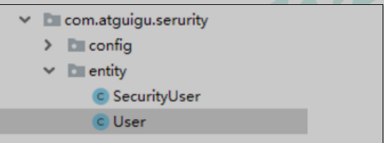

**(1)** **SecutityUser**

```java
@Data
@Slf4j
public class SecurityUser implements UserDetails {
 //当前登录用户
 private transient User currentUserInfo;
 //当前权限
 private List<String> permissionValueList;
 public SecurityUser() {
 }
 public SecurityUser(User user) {
 if (user != null) {
 this.currentUserInfo = user;
 }
 }
 @Override
 public Collection<? extends GrantedAuthority> getAuthorities() {
     Collection<GrantedAuthority> authorities = new ArrayList<>();
 for(String permissionValue : permissionValueList) {
 if(StringUtils.isEmpty(permissionValue)) continue;
 SimpleGrantedAuthority authority = new 
SimpleGrantedAuthority(permissionValue);
 authorities.add(authority);
 }
 return authorities;
 }
 @Override
 public String getPassword() {
 return currentUserInfo.getPassword();
 }
 @Override
 public String getUsername() {
 return currentUserInfo.getUsername();
 }
 @Override
 public boolean isAccountNonExpired() {
 return true;
 }
 @Override
 public boolean isAccountNonLocked() {
 return true;
 }
 @Override
 public boolean isCredentialsNonExpired() {
 return true;
 }
 @Override
 public boolean isEnabled() {
 return true;
 } }
```

**（**2****）****User**

```java
@Data
@ApiModel(description = "用户实体类")
public class User implements Serializable {
 private String username;
 private String password;
 private String nickName;
 private String salt;
 private String token; }
```

#### **4.3.3** **创建认证和授权的** **filter**

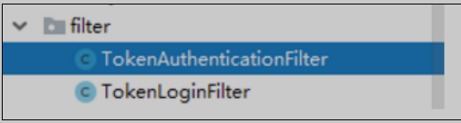

**（**1）TokenLoginFilter：认证的 filter** 

```java
public class TokenLoginFilter extends UsernamePasswordAuthenticationFilter {
 private AuthenticationManager authenticationManager;
 private TokenManager tokenManager;
 private RedisTemplate redisTemplate;
 public TokenLoginFilter(AuthenticationManager authenticationManager, 
TokenManager tokenManager, RedisTemplate redisTemplate) {
 this.authenticationManager = authenticationManager;
 this.tokenManager = tokenManager;
 this.redisTemplate = redisTemplate;
 this.setPostOnly(false);
 this.setRequiresAuthenticationRequestMatcher(new 
AntPathRequestMatcher("/admin/acl/login","POST"));
 }
 @Override
 public Authentication attemptAuthentication(HttpServletRequest req, 
HttpServletResponse res)
 throws AuthenticationException {
 try {
 User user = new ObjectMapper().readValue(req.getInputStream(), 
User.class);
 return authenticationManager.authenticate(new 
UsernamePasswordAuthenticationToken(user.getUsername(), user.getPassword(), new 
ArrayList<>()));
 } catch (IOException e) {
 throw new RuntimeException(e);
 }
 }
 /**
 * 登录成功
 */
 @Override
 protected void successfulAuthentication(HttpServletRequest req, 
HttpServletResponse res, FilterChain chain,
 Authentication auth) throws 
IOException, ServletException {
 SecurityUser user = (SecurityUser) auth.getPrincipal();
 String token =
     tokenManager.createToken(user.getCurrentUserInfo().getUsername());
 
redisTemplate.opsForValue().set(user.getCurrentUserInfo().getUsername(), 
user.getPermissionValueList());
 ResponseUtil.out(res, R.ok().data("token", token));
 }
 /**
 * 登录失败
 */
 @Override
 protected void unsuccessfulAuthentication(HttpServletRequest request, 
HttpServletResponse response,
 AuthenticationException e) throws IOException, ServletException {
 ResponseUtil.out(response, R.error());
 } }
```

**（**2）TokenAuthenticationFilter：授权 filter** 

```java
public class TokenAuthenticationFilter extends BasicAuthenticationFilter {
 private TokenManager tokenManager;
 private RedisTemplate redisTemplate;
 public TokenAuthenticationFilter(AuthenticationManager authManager, 
TokenManager tokenManager,RedisTemplate redisTemplate) {
 super(authManager);
 this.tokenManager = tokenManager;
 this.redisTemplate = redisTemplate;
 }
 @Override
 protected void doFilterInternal(HttpServletRequest req,
HttpServletResponse res, FilterChain chain)
 throws IOException, ServletException {
 logger.info("================="+req.getRequestURI());
 if(req.getRequestURI().indexOf("admin") == -1) {
 chain.doFilter(req, res);
 return;
 }
 UsernamePasswordAuthenticationToken authentication = null;
 try {
 authentication = getAuthentication(req);
 } catch (Exception e) {
 ResponseUtil.out(res, R.error());
 }
 if (authentication != null) {
 
SecurityContextHolder.getContext().setAuthentication(authentication);
 } else {
 ResponseUtil.out(res, R.error());
 }
     chain.doFilter(req, res);
 }
 private UsernamePasswordAuthenticationToken
getAuthentication(HttpServletRequest request) {
 // token 置于 header 里
 String token = request.getHeader("token");
 if (token != null && !"".equals(token.trim())) {
 String userName = tokenManager.getUserFromToken(token);
 List<String> permissionValueList = (List<String>) 
redisTemplate.opsForValue().get(userName);
 Collection<GrantedAuthority> authorities = new ArrayList<>();
 for(String permissionValue : permissionValueList) {
 if(StringUtils.isEmpty(permissionValue)) continue;
 SimpleGrantedAuthority authority = new SimpleGrantedAuthority(permissionValue);
 authorities.add(authority);
 }
 if (!StringUtils.isEmpty(userName)) {
 return new UsernamePasswordAuthenticationToken(userName, token, 
authorities);
 }
 return null;
 }
 return null;
 } }
```

## **5. SpringSecurity** **原理总结**

### **5.1 SpringSecurity** **的过滤器介绍**

SpringSecurity 采用的是责任链的设计模式，它有一条很长的过滤器链。现在对这条过滤器链的 15 个过滤器进行说明: 

（1） WebAsyncManagerIntegrationFilter：将 Security 上下文与 Spring Web 中用于处理异步请求映射的 WebAsyncManager 进行集成。

（2） SecurityContextPersistenceFilter：在每次请求处理之前将该请求相关的安全上下文信息加载到 SecurityContextHolder 中，然后在该次请求处理完成之后，将SecurityContextHolder 中关于这次请求的信息存储到一个“仓储”中，然后将SecurityContextHolder 中的信息清除，例如在 Session 中维护一个用户的安全信息就是这个过滤器处理的。

（3） HeaderWriterFilter：用于将头信息加入响应中。

（4） CsrfFilter：用于处理跨站请求伪造。

（5）LogoutFilter：用于处理退出登录。

（6）UsernamePasswordAuthenticationFilter：用于处理基于表单的登录请求，从表单中获取用户名和密码。默认情况下处理来自 /login 的请求。从表单中获取用户名和密码时，默认使用的表单 name 值为 username 和 password，这两个值可以通过设置这个过滤器的 usernameParameter 和 passwordParameter 两个参数的值进行修改。

（7）DefaultLoginPageGeneratingFilter：如果没有配置登录页面，那系统初始化时就会配置这个过滤器，并且用于在需要进行登录时生成一个登录表单页面。

（8）BasicAuthenticationFilter：检测和处理 http basic 认证。

（9）RequestCacheAwareFilter：用来处理请求的缓存。

（10）SecurityContextHolderAwareRequestFilter：主要是包装请求对象 request。 

（11）AnonymousAuthenticationFilter：检测 SecurityContextHolder 中是否存在Authentication 对象，如果不存在为其提供一个匿名 Authentication。 

（12）SessionManagementFilter：管理 session 的过滤器

（13）ExceptionTranslationFilter：处理 AccessDeniedException 和AuthenticationException 异常。

（14）FilterSecurityInterceptor：可以看做过滤器链的出口。

（15）RememberMeAuthenticationFilter：当用户没有登录而直接访问资源时, 从 cookie 里找出用户的信息, 如果 Spring Security 能够识别出用户提供的 remember me cookie, 用户将不必填写用户名和密码, 而是直接登录进入系统，该过滤器默认不开启。

### **5.2 SpringSecurity 基本流程**

**Spring Security** 采取过滤链实现认证与授权，只有当前过滤器通过，才能进入下一个过滤器：

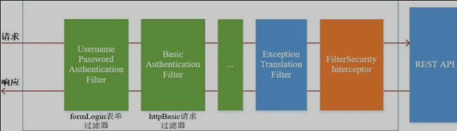

绿色部分是认证过滤器，需要我们自己配置，可以配置多个认证过滤器。认证过滤器可以使用 **Spring Security** 提供的认证过滤器，也可以自定义过滤器（例如：短信验证）。认证过滤器要在 **configure(HttpSecurity http)**方法中配置，没有配置不生效。下面会重点介绍以下三个过滤器：

**UsernamePasswordAuthenticationFilter** 过滤器：该过滤器会拦截前端提交的 POST 方式的登录表单请求，并进行身份认证。

**ExceptionTranslationFilter** 过滤器：该过滤器不需要我们配置，对于前端提交的请求会直接放行，捕获后续抛出的异常并进行处理（例如：权限访问限制）。

**FilterSecurityInterceptor** 过滤器：该过滤器是过滤器链的最后一个过滤器，根据资源权限配置来判断当前请求是否有权限访问对应的资源。如果访问受限会抛出相关异常，并由 **ExceptionTranslationFilter** 过滤器进行捕获和处理。

### **5.3 SpringSecurity 认证流程**

认证流程是在 **UsernamePasswordAuthenticationFilter** 过滤器中处理的，具体流程如下所示： 

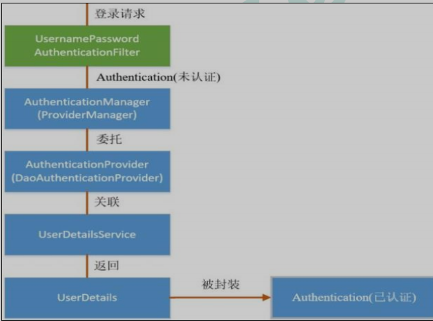

#### **5.3.1** **UsernamePasswordAuthenticationFilter 源码**

当前端提交的是一个 POST 方式的登录表单请求，就会被该过滤器拦截，并进行身份认证。该过滤器的 doFilter() 方法实现在其抽象父类

**AbstractAuthenticationProcessingFilter** **中，查看相关源码：** 

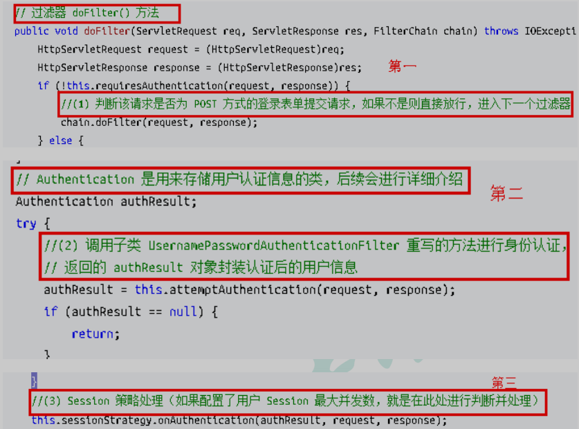

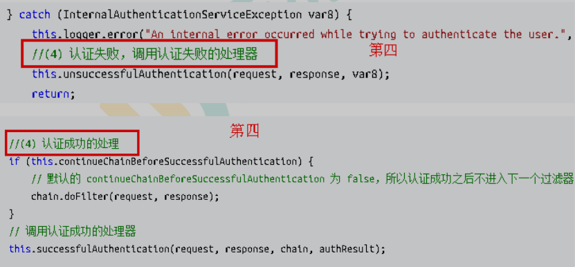

***\** 上述的 第二 过程调用了 UsernamePasswordAuthenticationFilter 的****attemptAuthentication() 方法，源码如下：**

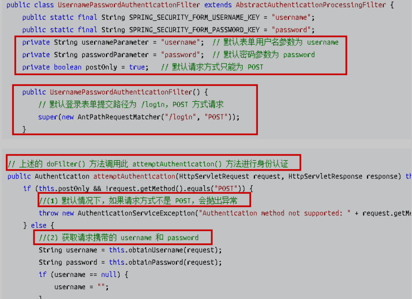

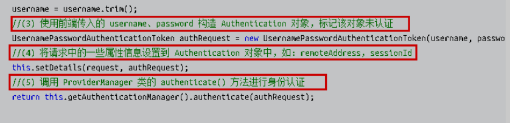

**上述的（3）过程创建的** **UsernamePasswordAuthenticationToken** **是**Authentication 接口的实现类，该类有两个构造器，一个用于封装前端请求传入的未认****证的用户信息，一个用于封装认证成功后的用户信息：**

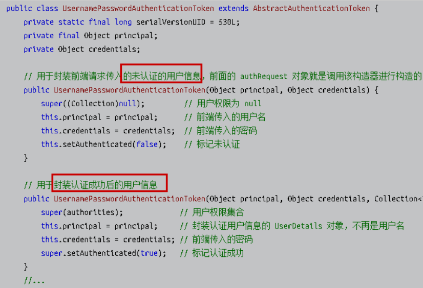

**Authentication 接口的实现类用于存储用户认证信息，查看该接口具体定义：**

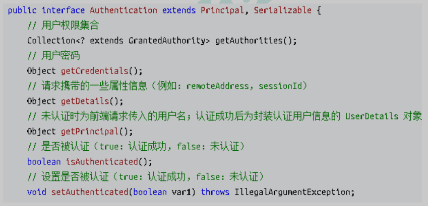

**5.3.2 ProviderManager** **源码**

上述过程中，**UsernamePasswordAuthenticationFilter** 过滤器的attemptAuthentication() 方法的**（****5****）过程**将未认证的 Authentication 对象传入ProviderManager 类的 authenticate() 方法进行身份认证。

ProviderManager 是 AuthenticationManager 接口的实现类，该接口是认证相关的核心接口，也是认证的入口。在实际开发中，我们可能有多种不同的认证方式，例如：用户名+密码、邮箱+密码、手机号+验证码等，而这些认证方式的入口始终只有一个，那就是AuthenticationManager。在该接口的常用实现类 ProviderManager 内部会维护一个**List<AuthenticationProvider>**列表，存放多种认证方式，实际上这是委托者模式（Delegate）的应用。每种认证方式对应着一个 AuthenticationProvider，AuthenticationManager 根据认证方式的不同（根据传入的 Authentication 类型判断）委托对应的 AuthenticationProvider 进行用户认证。

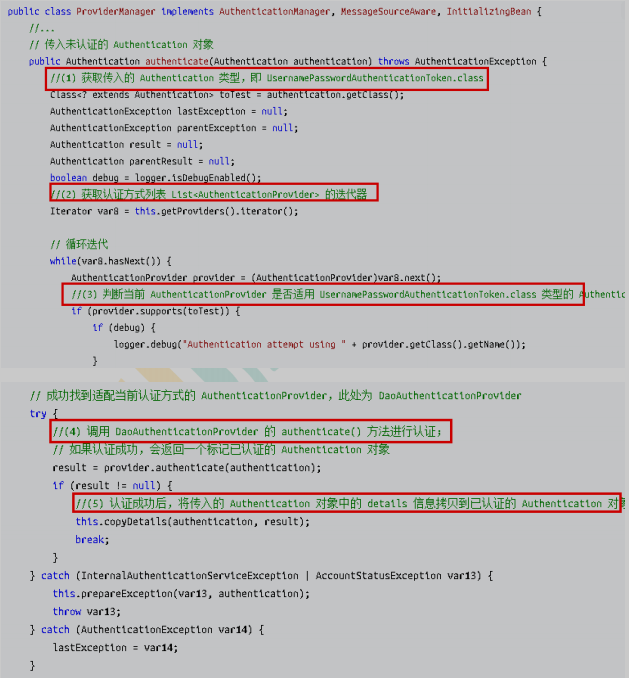

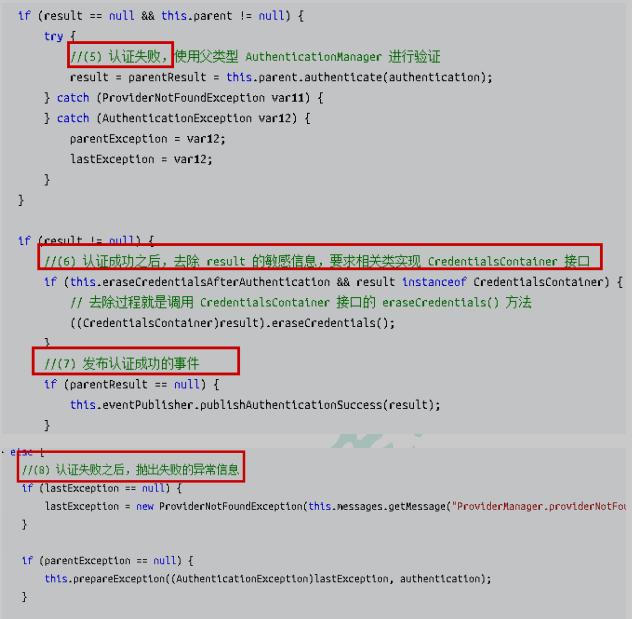

**上述认证成功之后的（****6****）过程，调用** **CredentialsContainer** **接口定义的**eraseCredentials()** **方法去除敏感信息。查看****UsernamePasswordAuthenticationToken** **实现的** **eraseCredentials()** **方法，该方**法实现在其父类中：**

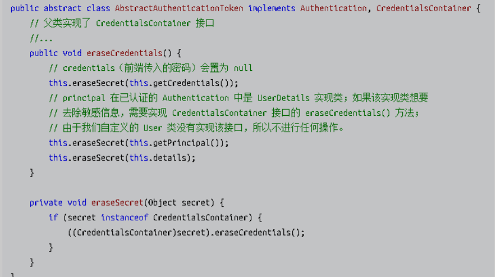

**5.3.3** **认证成功****/****失败处理**

上述过程就是认证流程的最核心部分，接下来重新回到

**UsernamePasswordAuthenticationFilter** 过滤器的 doFilter() 方法，查看认证成功/失败的处理：

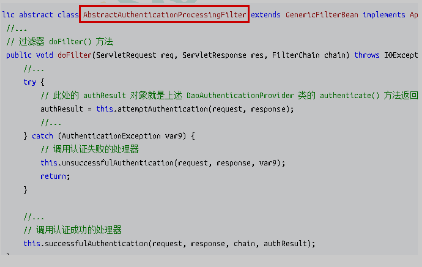

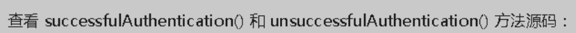

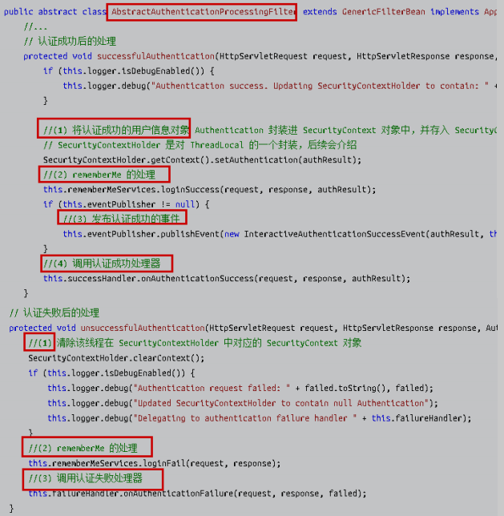

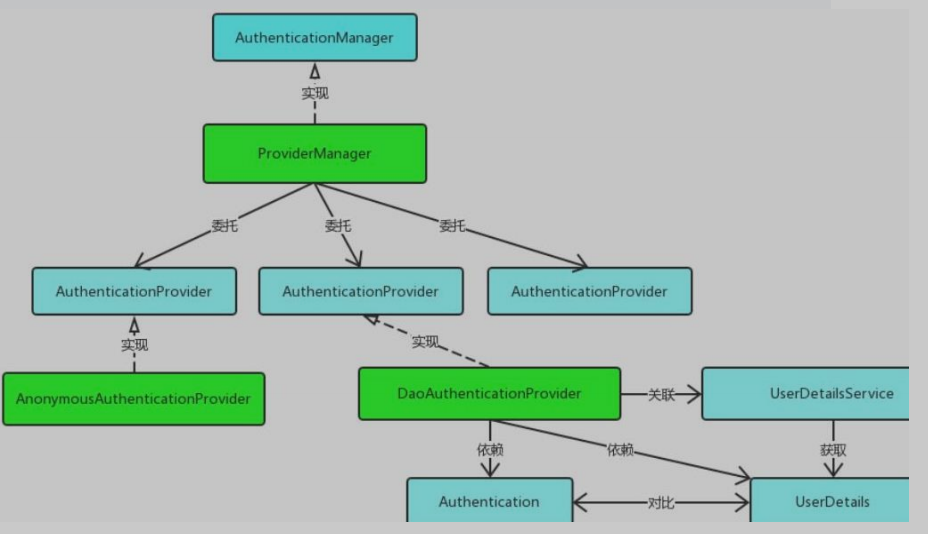

### **5.4 SpringSecurity 权限访问流程**

上一个部分通过源码的方式介绍了认证流程，下面介绍权限访问流程，主要是对**ExceptionTranslationFilter** 过滤器和 **FilterSecurityInterceptor** 过滤器进行介绍。

#### **5.4.1** **ExceptionTranslationFilter 过滤器**

该过滤器是用于处理异常的，不需要我们配置，对于前端提交的请求会直接放行，捕获后续抛出的异常并进行处理（例如：权限访问限制）。具体源码如下：

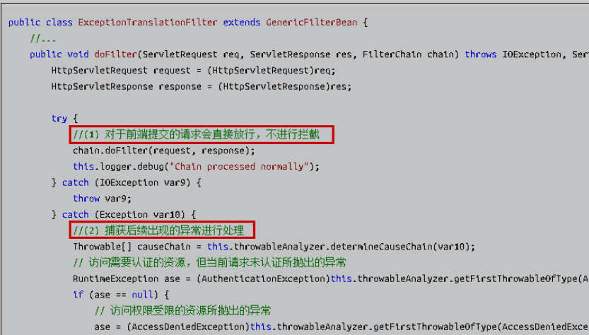

#### **5.4.2** **FilterSecurityInterceptor** **过滤器**

**FilterSecurityInterceptor** 是过滤器链的最后一个过滤器，该过滤器是过滤器链的最后一个过滤器，根据资源权限配置来判断当前请求是否有权限访问对应的资源。如果访问受限会抛出相关异常，最终所抛出的异常会由前一个过滤器

**ExceptionTranslationFilter** 进行捕获和处理。具体源码如下：

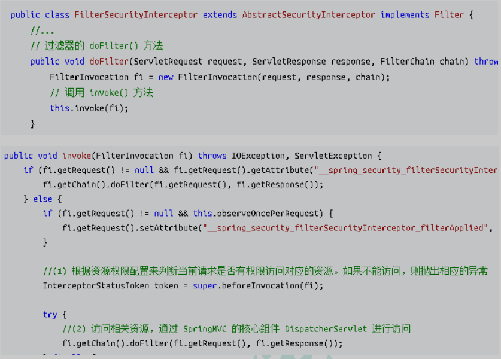

需要注意，**Spring Security** 的过滤器链是配置在 SpringMVC 的核心组件DispatcherServlet 运行之前。也就是说，请求通过 **Spring Security** 的所有过滤器，不意味着能够正常访问资源，该请求还需要通过 SpringMVC 的拦截器链。

### **5.5 SpringSecurity 请求间共享认证信息**

一般认证成功后的用户信息是通过 Session 在多个请求之间共享，那么 **Spring** **Security** 中是如何实现将已认证的用户信息对象 Authentication 与 Session 绑定的进行具体分析。

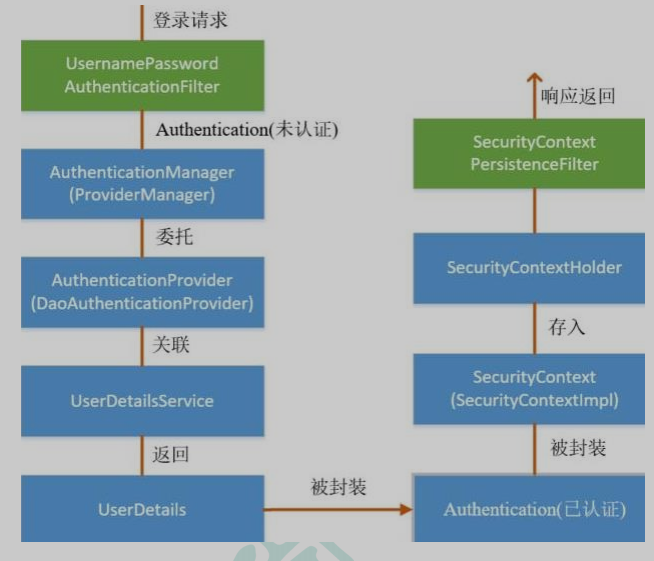

⚫ 在前面讲解认证成功的处理方法 successfulAuthentication() 时，有以下代码：

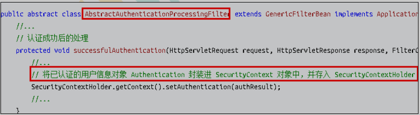

⚫ 查 看 SecurityContext 接 口 及 其 实 现 类 SecurityContextImpl ， 该 类 其 实 就 是 对Authentication 的封装：

⚫ 查 看 SecurityContextHolder 类 ， 该 类 其 实 是 对 ThreadLocal 的 封 装 ， 存 储SecurityContext 对象：

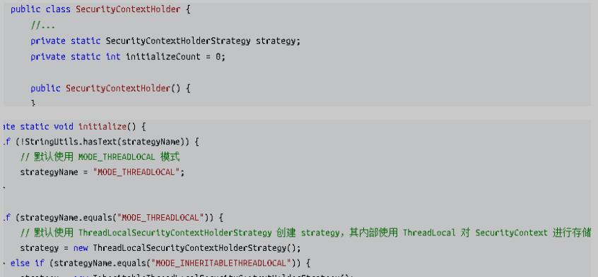

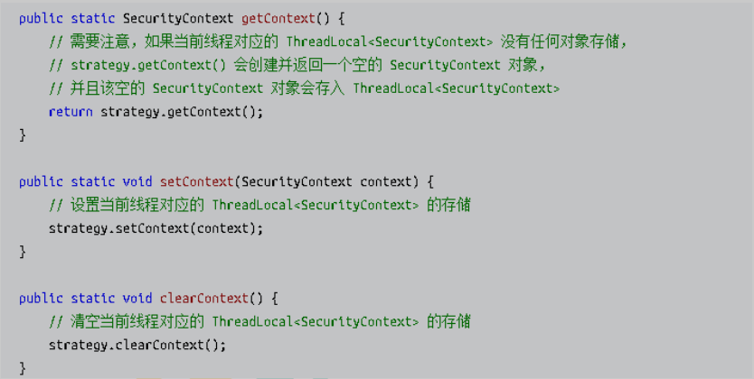

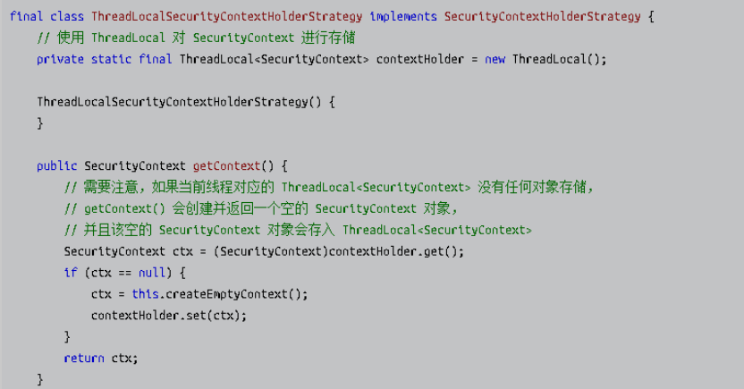

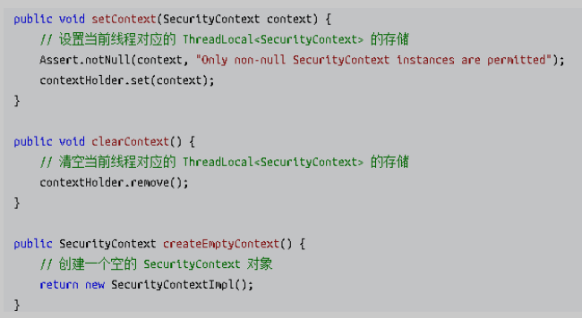

#### **5.5.1 SecurityContextPersistenceFilter 过滤器**

前面提到过，在 **UsernamePasswordAuthenticationFilter** 过滤器认证成功之后，会在认证成功的处理方法中将已认证的用户信息对象 Authentication 封装进SecurityContext，并存入 SecurityContextHolder。

之后，响应会通过 **SecurityContextPersistenceFilter** 过滤器，该过滤器的位置在所有过滤器的最前面，请求到来先进它，响应返回最后一个通过它，所以在该过滤器中处理已认证的用户信息对象 Authentication 与 Session 绑定。

认证成功的响应通过 **SecurityContextPersistenceFilter** 过滤器时，会从SecurityContextHolder 中取出封装了已认证用户信息对象 Authentication 的SecurityContext，放进 Session 中。当请求再次到来时，请求首先经过该过滤器，该过滤器会判断当前请求的 Session 是否存有 SecurityContext 对象，如果有则将该对象取出再次放入 SecurityContextHolder 中，之后该请求所在的线程获得认证用户信息，后续的资源访问不需要进行身份认证；当响应再次返回时，该过滤器同样从 SecurityContextHolder 取出SecurityContext 对象，放入 Session 中。具体源码如下：

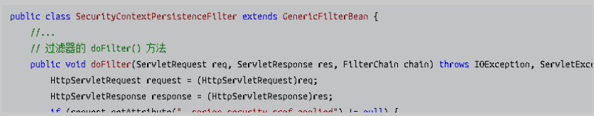

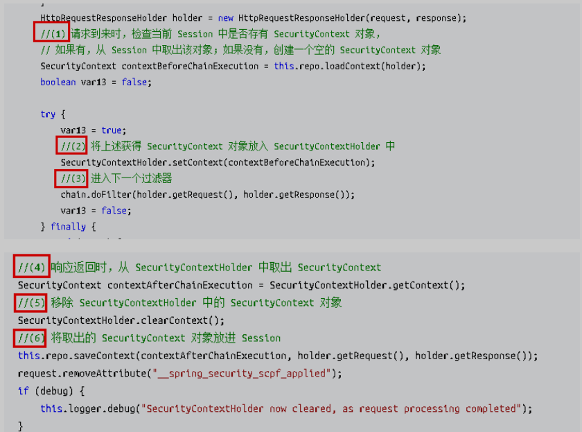


